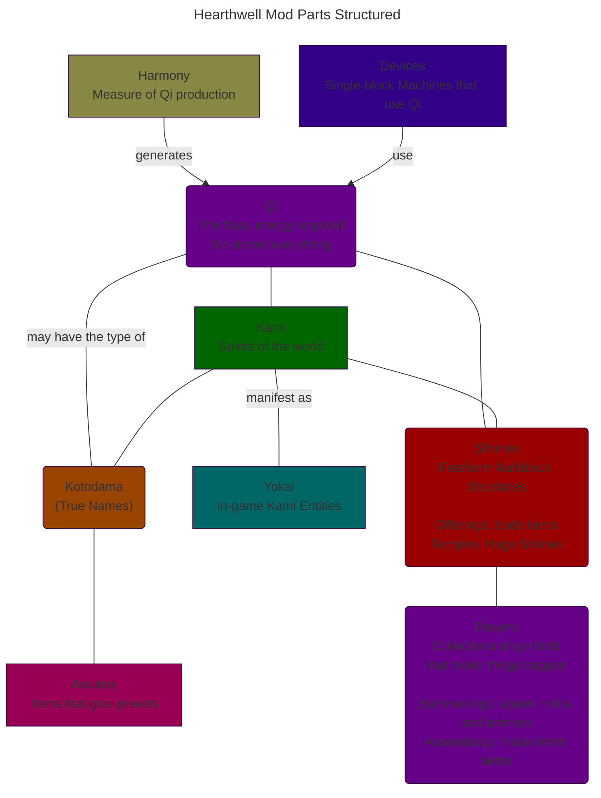

# Hearthwell3
Hearthwell mod for minecraft

```mermaid
---
title: Hearthwell Mod Parts Structured
---

%%{init:{'flowchart':{ 
    'titleTopMargin': 1,
    'diagramPadding': 1,
    'nodeSpacing': 10, 
    'rankSpacing': 10,
    'padding': 1,
}}}%%

flowchart TB

    Harmony["Harmony\nMeasure of Qi production"]
    Devices["Devices\nSingle-block Machines that use Qi"]
    Qi("Qi\nThe base energy required\n for almost everything")
    Kotodama("Kotodama\n(True Names)")
    Amulets["Amulets\nItems that give powers"]
    Kami["Kami\nSpirits of the world"]
    Yokai["Yokai\nIn-game Kami Entities"]
    Shrines("Shrines\nFreeform Multiblock Structures\n\nOfferings: trade items\nTemples: Huge Shrines") 
    Prayers("Prayers\nCollections of symbols\nthat make things happen\n\nSummonings: spawn mobs and animals\nAscendancy: make items better")

    Qi --- Kami
    Qi --- Shrines
    Qi -- "may have the type of" --- Kotodama
    Kami  -- "manifest as" ---Yokai
    Kami --- Kotodama
    Kotodama --- Amulets 
    Harmony -- "generates" --> Qi
    Devices -- "use" --> Qi
    Kami --- Shrines
    Shrines --- Prayers

    style Harmony fill:#888844,stroke:#330044
    style Qi fill:#660088,stroke:#330044
    style Devices fill:#330088,stroke:#330044
    style Shrines fill:#990000,stroke:#330044,nodeSpacing:1
    style Prayers fill:#660088,stroke:#330044
    style Amulets fill:#990055,stroke:#330044
    style Kotodama fill:#994400,stroke:#330044
    style Kami fill:#006600,stroke:#330044
    style Yokai fill:#006666,stroke:#330044

    classDef n fill:none,stroke:none;

```